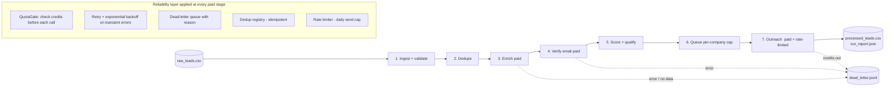

# Lead Enrichment & Outreach Pipeline

A resilient, multi-stage data pipeline that turns a raw list of companies into
verified, scored, ready-to-contact leads — and pushes the qualified ones into an
outreach step. Built to demonstrate the reliability engineering that separates a
throwaway automation script from something you'd trust running unattended against
**paid, rate-limited, occasionally-flaky third-party APIs**.


-brightgreen)


> **Portfolio project.** All external providers are mocked and all data is
> synthetic. No real services, credentials, customer data, or company IP are
> involved. Runs with **zero setup** — Python standard library only.

---

## Why this exists

Anyone can chain a few API calls together. The hard part — and the part that
actually costs money and breaks at 3am — is what happens when a provider times
out, runs out of credits mid-batch, returns junk, or hands you the same record
twice. This project is a compact, runnable model of how I handle exactly that.

**What it demonstrates:**

- Designing a staged pipeline with a clear funnel and per-stage accountability
- Never losing a record silently — every failure is captured with a reason
- Spending paid API credit deliberately, with a hard stop before overspend
- Making flaky dependencies reliable through bounded retry + backoff
- Keeping the whole thing configuration-driven and unit-tested

---

## Architecture



Each stage narrows the funnel. A lead only advances if it earns it; everything
else lands in a terminal status (`duplicate`, `skipped`, `paused_api_limit`,
`dead_lettered`) so nothing vanishes.

---

## The reliability layer (the interesting part)

All of this lives in [`src/reliability.py`](src/reliability.py) and is exercised
by the pipeline in [`src/pipeline.py`](src/pipeline.py).

| Primitive | Problem it solves | Behaviour |
|---|---|---|
| **QuotaGate** | Burning through a monthly API budget mid-run | Checks `can_afford()` **before every paid call**; when credits run out the lead is marked `paused_api_limit` and set aside to resume later — the run stops cleanly instead of failing dirty. |
| **Retry + backoff** | Transient timeouts / 5xx / rate-limits | Retries only *retryable* errors, up to N attempts, with exponential backoff. A `PermanentError` (e.g. "no data found") is **never** retried — no wasted calls. |
| **Dead-letter queue** | Records disappearing on failure | Every failed record is written to `dead_letter.jsonl` with its stage, reason, and detail — so failures are triaged, not lost. |
| **Dedup registry** | Contacting the same company twice | Idempotency check per configurable key; can be seeded from prior runs. |
| **Rate limiter** | Blowing past a daily send cap | Sends up to the cap, then defers the overflow to `queued` for the next run. |

Design note: the retry helper takes an injectable `sleeper`, so backoff logic is
unit-tested without real time or real network. Same idea throughout — the code is
built to be testable, not just runnable.

---

## Quickstart

No install step. No dependencies.

```bash
# 1. Run the pipeline on the bundled synthetic data
python main.py

# 2. Run the test suite
python -m unittest discover -s tests
```

> **Windows note:** if typing `python` opens the Microsoft Store, use the launcher
> instead: `py main.py` and `py -m unittest discover -s tests`.

Outputs are written to `output/`:
- `processed_leads.csv` — every lead with its final stage + status
- `dead_letter.jsonl` — failed records, each with a reason
- `run_report.json` — machine-readable run metrics

---

## Live dashboard

A self-contained HTML report is generated from a real run — metric tiles, the
funnel, the outcome breakdown, provider spend, and the dead-letter queue. It is
theme-aware (light/dark) and depends on nothing external.

```bash
python build_site.py     # runs the pipeline, writes site/index.html
```

Open `site/index.html` in any browser to view it, or deploy the `site/` folder
as a static site.

**Deploy on Render (Static Site):**
1. Push this repo to GitHub.
2. Render → **New → Static Site** → connect the repo.
3. **Build command:** *(leave blank — the page is pre-built and committed)*
4. **Publish directory:** `site`
5. Deploy. Static sites are always-on (no cold starts) and free.

> To regenerate after changing `config.json` or the data, re-run
> `python build_site.py` and commit the updated `site/index.html`.

---

## Example run

Behaviour is **deterministic** (failures are seeded from a hash), so you get the
same result every time — which makes the metrics reproducible and demo-friendly.

```
========================================================
  RUN REPORT
========================================================
  Input records            : 28
  Valid ingested           : 26
  Contacted                : 12
  Ingest -> contact rate   : 46.2 %
  Dead-lettered            : 7
  Retries performed        : 5
  Simulated spend          : $2.9
--------------------------------------------------------
  Funnel:
    ingested     26
    deduped      25
    enriched     20
    verified     16
    scored       12
    queued       12
    contacted    12
--------------------------------------------------------
  Final status breakdown:
    contacted            12
    dead_lettered        5
    duplicate            1
    skipped              8
--------------------------------------------------------
  Providers:
    enrichment    calls=25  credits_left=15  spend=$2.5
    verification  calls=20  credits_left=20  spend=$0.4
    outreach      calls=12  credits_left=88  spend=$0.0
========================================================
```

Reading the funnel: of 28 input rows, **2** were rejected at ingest (malformed /
missing domain) and **1** was a duplicate company. Enrichment and verification
shed leads to "no data found" and unverifiable emails; scoring dropped contacts
whose job titles weren't a fit. **12** qualified leads were contacted — comfortably
under the daily cap — and every dropped record is accounted for in
`dead_letter.jsonl` or a terminal status. Two example dead-letter entries:

```json
{"lead_id": "L025", "stage": "ingest", "reason": "invalid_input", "detail": "company='Broken Record Inc' domain='not a domain'"}
{"lead_id": "L002", "stage": "enrich", "reason": "no_data", "detail": "no contact found for domain"}
```

---

## Configuration

Everything tunable lives in [`config.json`](config.json) — nothing is hardcoded in
the logic. Change these and re-run to watch the funnel and spend shift:

```jsonc
{
  "providers": {
    "enrichment":   { "credits": 40, "unit_cost_usd": 0.10,
                      "transient_fail_rate": 0.25, "no_data_rate": 0.15 },
    "verification": { "credits": 40, "unit_cost_usd": 0.02,
                      "transient_fail_rate": 0.15, "invalid_rate": 0.20 },
    "outreach":     { "credits": 100, "unit_cost_usd": 0.00 }
  },
  "retry":  { "attempts": 3, "base_delay_seconds": 0.0, "backoff_factor": 2.0 },
  "rules":  { "dedup_key": "domain", "max_contacts_per_company": 3,
              "min_title_score": 1, "daily_outreach_cap": 15 }
}
```

Try `"credits": 5` on enrichment to see the QuotaGate pause the run, or bump
`transient_fail_rate` to watch retries climb.

---

## Lead scoring

Contacts are scored on job-title signal by **decision-making authority** (a common
lead-qualification pattern); only titles at or above `min_title_score` proceed to outreach:

| Score | Signal | Example titles |
|---|---|---|
| 3 | Senior decision-maker / budget owner | *Founder / CEO*, *VP of Marketing*, *Chief Marketing Officer*, *Head of Growth*, *Director* |
| 2 | Manager or team lead | *Marketing Manager*, *Brand Manager*, *Growth Team Lead* |
| 1 | Individual contributor | *Marketing Analyst*, *Growth Coordinator*, *Communications Specialist* |
| 0 | No buying authority — skipped | *Marketing Intern*, *Sales Assistant*, *Support Agent*, *Office Receptionist* |

---

## Project structure

```
lead-enrichment-pipeline/
├── main.py                  # entry point + run summary
├── config.json              # all runtime parameters (nothing hardcoded)
├── data/raw_leads.csv       # synthetic input
├── src/
│   ├── models.py            # Lead, Stage, Status
│   ├── reliability.py       # QuotaGate, retry, DLQ, dedup, rate limiter  ← core
│   ├── providers.py         # mocked enrichment / verification / outreach APIs
│   └── pipeline.py          # the 7-stage orchestrator
├── tests/test_reliability.py# unit tests for the reliability layer
└── output/                  # run artifacts (git-ignored)
```

---

## How this maps to a real deployment

The mocked providers stand in for real, swappable services. The pipeline logic
doesn't change when you plug in the real thing:

| Mock in this repo | Real-world equivalent (examples) |
|---|---|
| `EnrichmentProvider` | A B2B data / contact-enrichment API |
| `VerificationProvider` | An email-verification service |
| `OutreachProvider` | A cold-email / sequencing platform |

The same architecture also runs happily inside a no-code orchestrator (n8n, Make,
Zapier) — the stages become nodes and the reliability layer becomes credit checks,
error branches, and a dead-letter sheet. The engineering judgment is identical;
only the surface changes.

---

## Testing

```bash
python -m unittest discover -s tests -v
```

Covers retry recovery and exhaustion, that permanent errors aren't retried, quota
charging and exhaustion, dedup detection, and the rate cap — 8 tests, all passing,
no third-party runner required.

---

## License

MIT — see [LICENSE](LICENSE).

*Built by Paolo as a portfolio demonstration of resilient data-pipeline design.*
